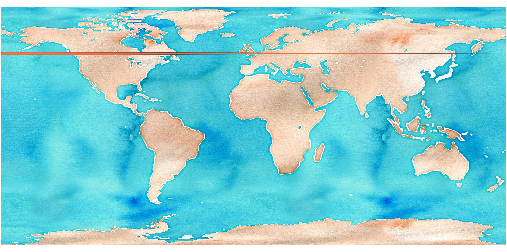
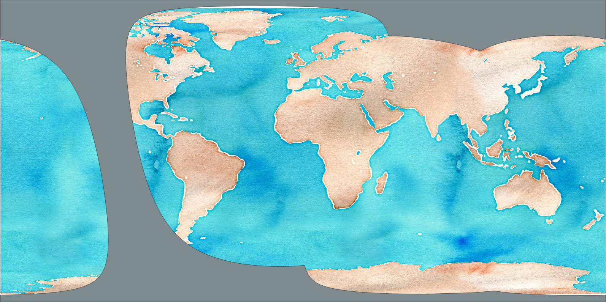

# antimeridian

[](https://github.com/gadomski/antimeridian/actions/workflows/ci.yaml)
[](http://www.gadom.ski/antimeridian/)
[](./LICENSE)
[](./CODE_OF_CONDUCT)

A Python package to correct GeoJSON shapes that cross the antimeridian.

## Usage

```shell
pip install git+https://github.com/gadomski/antimeridian
```

Then, in your code:

```python
import antimeridian
fixed = antimeridian.fix_geojson(geojson)
```

There's a command-line entrypoint, too:

```shell
fix-antimeridian input.json > output.json
```

## Background

### What's the antimeridian?

Also known as the [180th meridian](https://en.wikipedia.org/wiki/180th_meridian), the antimeridian is the line of longitude on the opposite side of the world from the prime meridian.
It can be either 180° east or west.


### What's the problem?

The GeoJSON specification [recommends cutting geometries at the antimeridian](https://www.rfc-editor.org/rfc/rfc7946#section-3.1.9).
Many real-world geometries, however, don't follow this recommendation.
It's very common to create a geometry in a projected coordinate system, then reproject that geometry to WGS84 to use it in GeoJSON.
The reprojection process usually does not split the output geometry across the antimeridian, leading to invalid geometries.
Here's a simple example, taken from a real-world [Landsat](https://landsat.gsfc.nasa.gov/) [STAC](https://stacspec.org) item:

```json
{
    "type": "Polygon",
    "coordinates": [
        [
            [
                -179.70358951407547,
                52.750507455036264
            ],
            [
                179.96672360880183,
                52.00163609753924
            ],
            [
                -177.89334479610974,
                50.62805205289558
            ],
            [
                -179.9847165338706,
                51.002602948712465
            ],
            [
                -179.70358951407547,
                52.750507455036264
            ]
        ]
    ]
}
```

As you can see, a tiny corner of the polygon crosses the antimeridian, leading to an invalid item:



The issue also arises when geometries cross over a pole.

### How do we fix it?

We use a relatively simple algorithm that splits the input polygon into segments.
Each segment is defined by jumps of greater than 180° longitude -- it's not a perfect heuristic, but tends to work for most real-world geometries we've encountered.
Segments are then joined along the antimeridian.
Segments that enclose the poles are constructed by adding points at the top of the antimeridian at both the east and the west longitudes.

Here's before and after pictures of some Sentinel 5p data.
These are swath data that enclose both poles.
In the before picture, you can see the strange artifacts created by the invalid geometry:


After correction, it's more clear that the data covers both poles:



Our library also handles splitting complex polygons that cross the antimeridian:


## Contributing

Github [issues](https://github.com/gadomski/antimeridian/issues) and [pull requests](https://github.com/gadomski/antimeridian/pulls), please and thank you!

## License

[Apache-2.0](./LICENSE)
